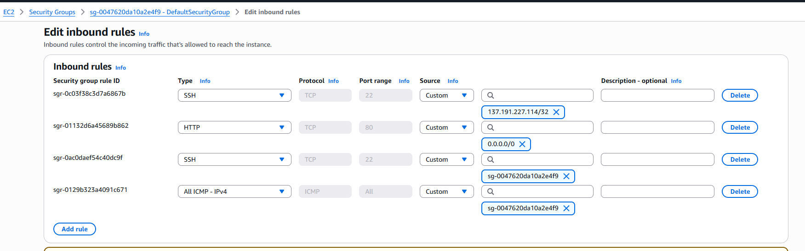
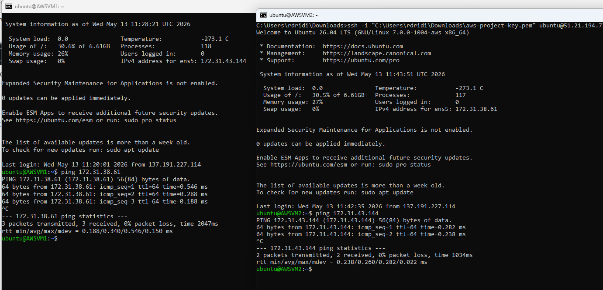
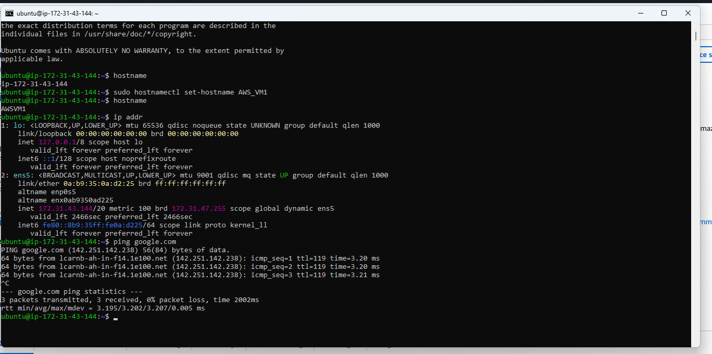
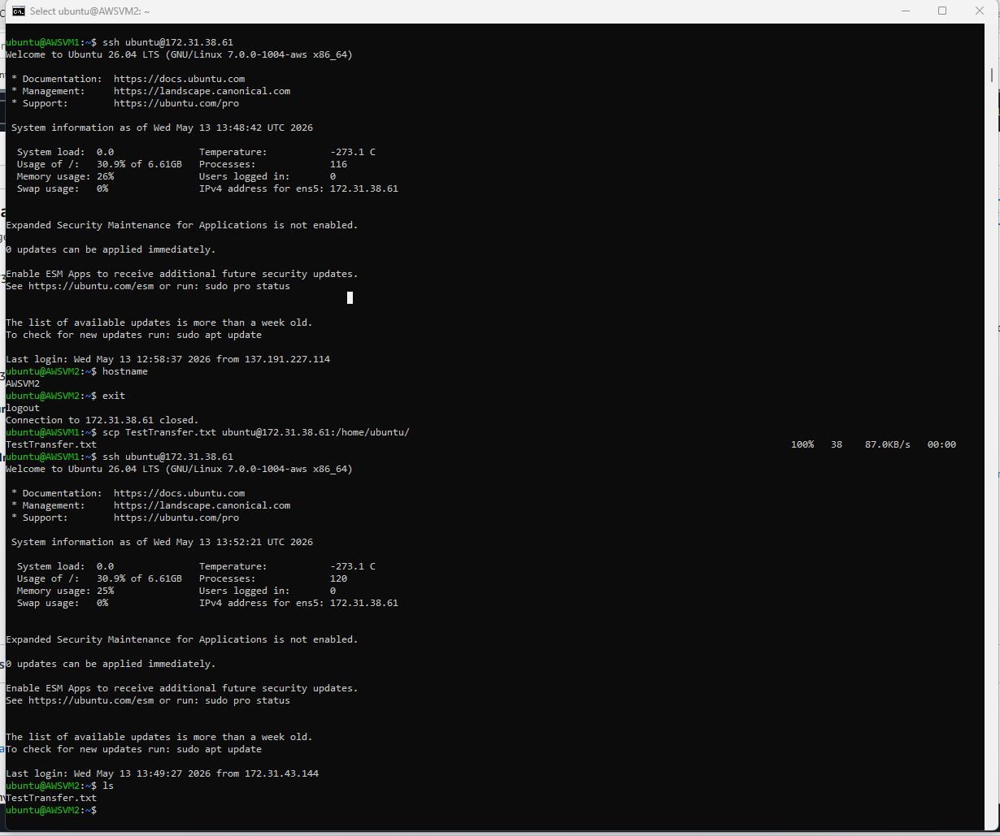
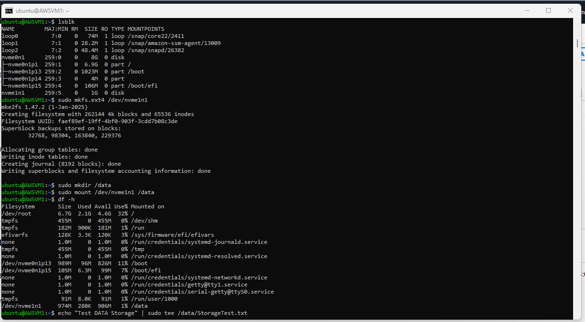
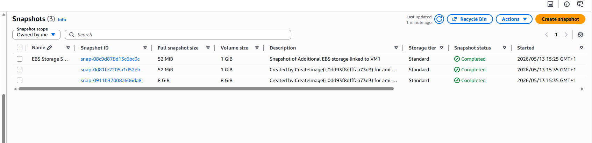
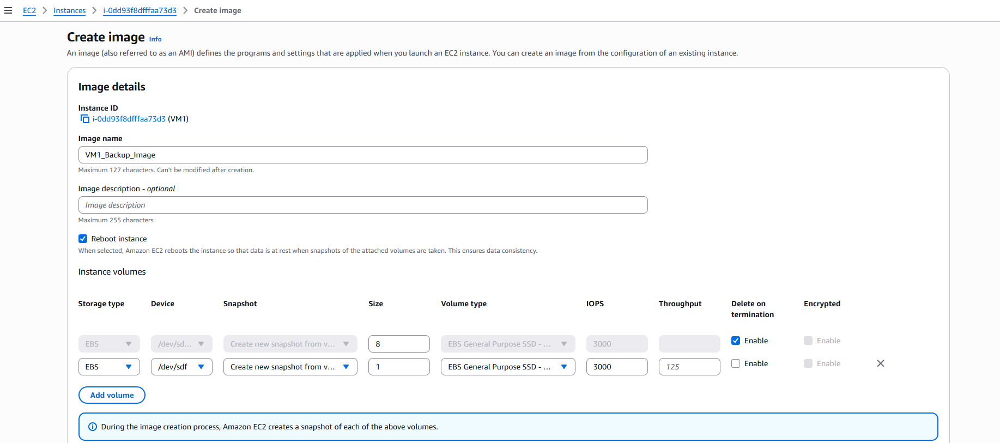
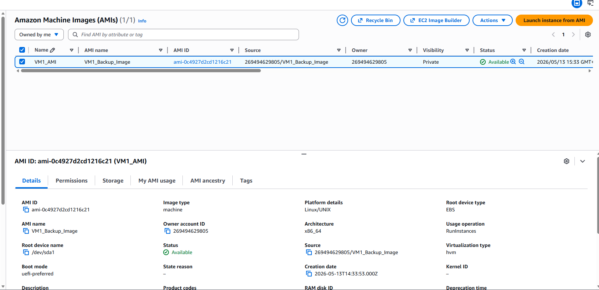
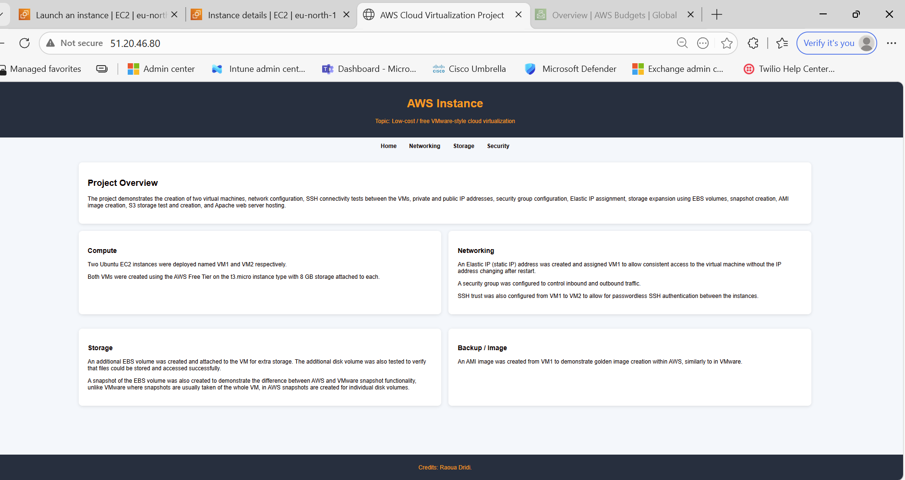

# AWS

## Index

- [Overview](#Overview)
- [Virtual Machine (VM) Creation](#Virtual_Machine_(VM)_Creation)
- [Connectivity testing](#Connectivity_testing)
- [SSH Connectivity and File Transfer Testing](#SSH_Connectivity_and_File_Transfer_Testing)
- [Additional Storage Volume Configuration and Testing](#Additional_Storage_Volume_Configuration_and_Testing)
- [EBS Snapshot creation](#EBS_Snapshot_Creation)
- [AMI Image](#AMI_Image)
- [Web Server Apache Deployment](#Web_Server_Apache_Deployment)
- [Conclusion](#Conclusion)

# Overview
The aims of this project is to examine low cost VMWare equivalent solutions in the cloud. This document evaluates Amazon Web Services (AWS) as a virtualization option and provides a step-by-step walkthrough of the tests and configurations completed throughout the project.

# Virtual Machine (VM) Creation
Two VMs were created using:
- Ubuntu Server
- t3.micro instance 
- 8 GB EBS storage

The t3.micro instance type was selected as it is included within the AWS Free Tier and provides sufficient resources for this project.  
During the deployment of the instance, a dedicated security group was also configured to control inbound traffic, in AWS, security groups can be used similarly to firewall rules within VMWare.  

The security group called (DefaultSecurityGroup) was configured to allow:
- SSH access (Port 22) for remote administration
- HTTP traffic (Port 80) for Apache web server hosting
- ICMP traffic for ping and connectivity testing between the VMs  
The screenshot below provides the implemented configuration.

 

# Connectivity testing

After the deployment of both VMs, a connectivity test was completed to verify communication between VM1 and VM2 using their private IP addresses, which was succesful as shown in the screenshot below.    
    
   
Unlike in VMware Workstation where additional network configuration needs to be implemented, such as NAT or bridged network, both AWS VMs already had internet connection available through the default AWS VPC configuration.  
    

# SSH Connectivity and File Transfer Testing
SSH connectivity between the two VMs was tested using their respective IP addresses and the SSH key created during the deployement of the first instance.  
File transfer testing was also completed using Secure Copy Protocol (SCP) where a test file was copied successfully from VM1 to VM2 and verified after the transfer completed as shown in the screenshot provided.   

   

# Additional Storage Volume Configuration and Testing
For testing puposes, an additional 1 GB Elastic Block Store (EBS) storage volume was created and attached to VM1. 
Using the command 'lsblk', the additional disk storage was verified, as shown in the screenshot below. A file was then created within the disk and tested successfully to confirm that the storage was working as intended.    
  

# EBS Snapshot creation
Unlike in VMware workstation where snapshots are usually taken of the full VM, in AWS snapshots are created of individual storage volumes, in this test multiple snapshots have been taken including a separte snapshot of the additional 1GB EBS storage.  
This test also demonstrates how EBS storage can exist independently from the VM, meaning the volume and its snapshots can still remain available even if the VM itself is removed.  

  

# AMI Image

Similar to VMware workstation, in AWS a golden VM image can be created and reused to facilitate the deployment of additional VMs requiring the same operating system (OS) and configuration.  
The below screenshot provides the creation process, the delete on termination setting for the attached storage volumes was also reviewed, as mentioned above in AWS you can control whether the EBS storage volume is deleted automatically when the virtual machine is terminated or kept separately.  
  

The golden image was succesfully created as shown below.

# Web Server Apache Deployment
After enabling HTTP traffic in the security group, Apache was installed and tested successfully.  
The default Apache webpage was then replaced with a custom one summarising the work completed for this project, both HTML and CSS files used for the below webpage are attached as part of this assignment.  

# Conclusion

This practical work successfully demonstrated how AWS can be used as a low-cost / free cloud virtualization platform similar to VMware environment.  
The aim of this document is successfully met, demonstrating VM deployment, network configuration, SSH connectivity, storage expansion, EBS snapshot functionality, AMI image creation, and Apache web server hosting within AWS.  
The practical work also demonstrated some of the differences between traditional VMware virtualization and cloud-based virtualization within AWS.