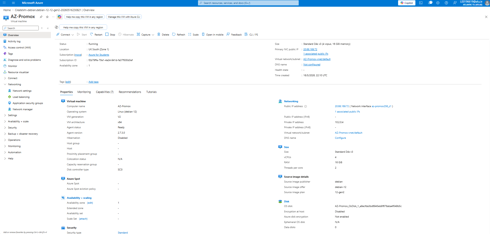
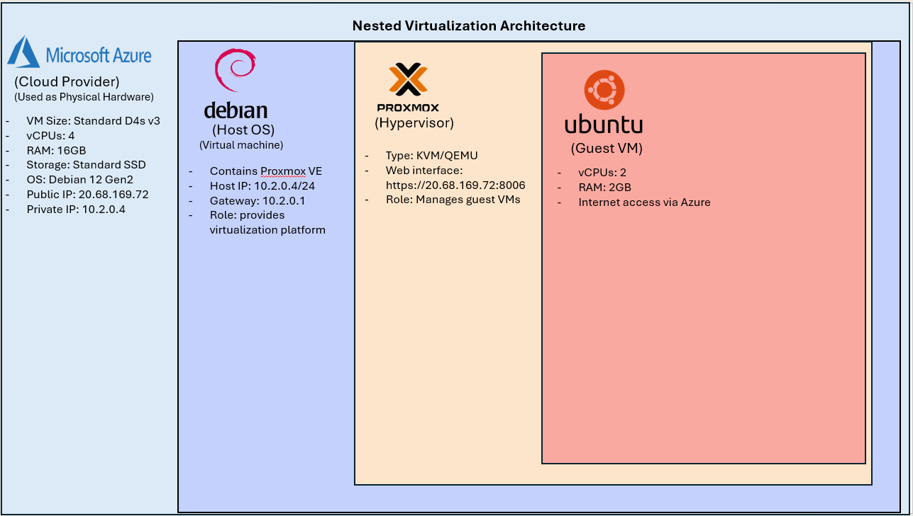
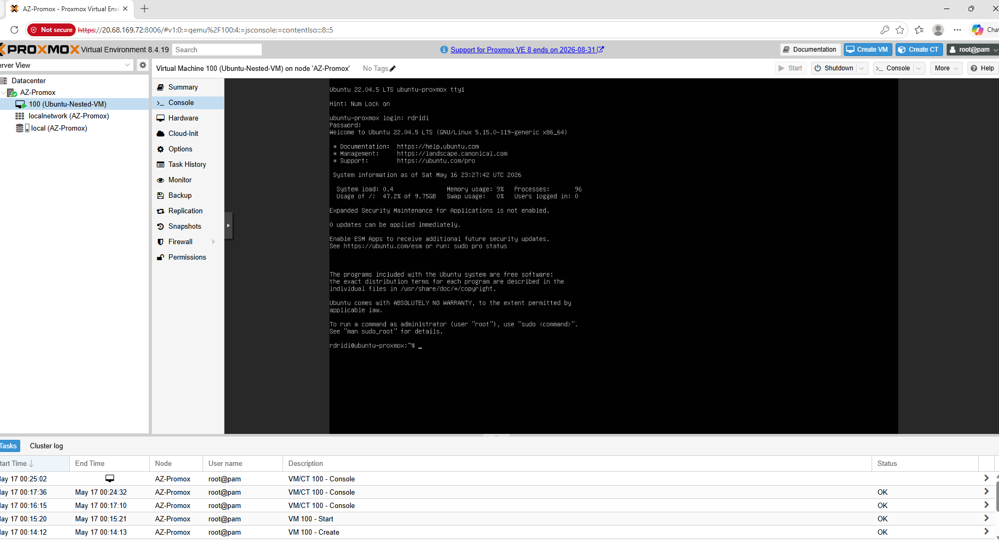
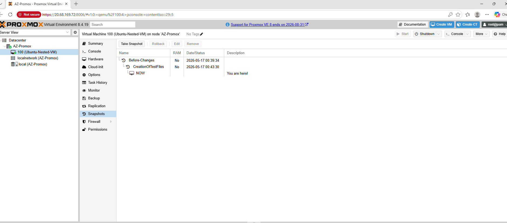
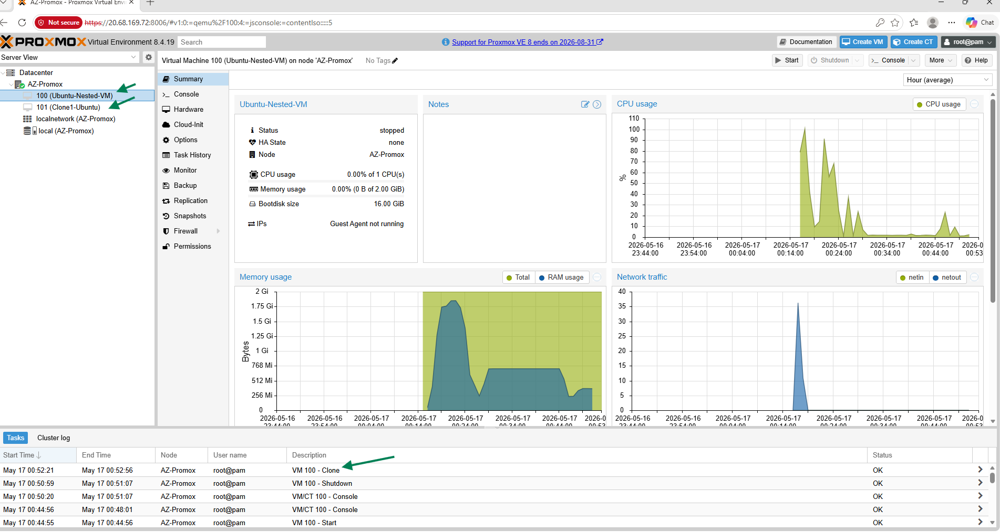
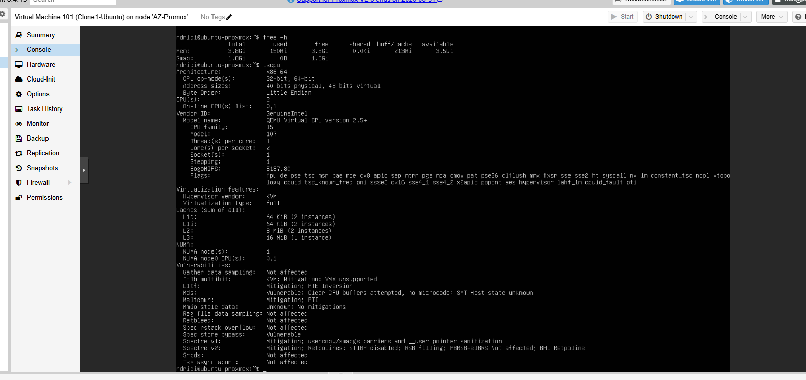

### Project Overview

The purpose of this practical work is to examine low-cost / free VMware-style virtualization options available within cloud environments. The project focused on testing whether enterprise virtualization functionality could be achieved using cloud infrastructure combined with open-source virtualization technologies instead of relying entirely on a vendor-controlled virtualization platform.

Microsoft Azure was selected as the cloud platform for this practical work due to its ability to provide scalable virtual machine resources suitable for nested virtualization testing. A Debian 12 virtual machine was deployed and configured within Azure to host the Proxmox VE hypervisor and make use of its free virtualization features. 

### Objectives of the Practical Work

The aims of this practical work are:

- Deploy a virtual machine within Microsoft Azure
- Install and configure Proxmox VE within the Azure vm
- Test nested virtualization functionality
- Create and manage guest virtual machines
- Evaluate VM management functions by creating backups, cloning virtual machines and restoring previous system states through backups
- Examine vendor lock-in by testing VM portability between Proxmox and VMware Workstation Pro
- Evaluate whether low-cost cloud infrastructure can provide enterprise virtualization functionality

### Azure Virtual Machine Deployment

The first step of the project involved deploying a Debian 12 virtual machine. After attepmting to deploy multiple virtual machines with different operating systems versions for nested virtualization, Debian 12 was ultimately selected. Different versions of Ubuntu encountered compatibility and dependency issues during the Proxmox installation process.

The Azure virtual machine was configured with:

- Standard D4s v3 virtual machine size
- 4 virtual CPUs
- 16 GB RAM
- Standard SSD storage
- Public SSH access
- Standard security configuration

The below screenshot summarises the virtual machine properties

### Proxmox VE Installation and Configuration

After Successfully deploying the Azure virtual machine, Proxmox VE 8 was installed and configured on the Debian 12 system.

The installation process involved:

- Configuring Proxmox repositories
- Installing virtualization packages
- Configuring networking
- Creating a Proxmox bridge interface (vmbr0)
- Configuring Proxmox services
- Configuring web management access

During the installation process several troubleshooting steps were required, particularly relating to:

- dependency compatibility
- SSL certificate generation
- bridge networking configuration

The successful deployment of Proxmox VE demonstrated that enterprise-style virtualization platforms can run reliably inside cloud-hosted virtual machines.

### Nested Virtualization Testing

Nested virtualization refers to running virtual machines inside another virtualized environment and one of the main objectives of this practical work was testing nested virtualization functionality.

The architecture of this practical work is represented in the below diagram:

As per below screenshot a nested Ubuntu Server virtual machine was successfully deployed within Proxmox VE. 

This test confirmed that Microsoft Azure could support a complete virtualization environment capable of hosting additional guest virtual machines. 

### Snapshots 

Initially, two files named "rollback.txt" and "snapshot.txt" were created within the guest virtual machine and a snapshot of the virtual machine’s state was then created using Proxmox VE.

Both files were later deleted and checked to ensure they were no longer present. Next the virtual machine was restored to its previous state where both "rollback.txt" and "snapshot.txt" reappeared, confirming that the snapshot and recovery functionality functioned correctly.

The above test confirmed that Proxmox VE can preserve and restore virtual machine states, similar to enterprise virtualization platforms such as VMWare.

### Clone and Resource Allocation Testing

A full clone of the nested Ubuntu virtual machine was created successfully and powered on without issues.

To examine resource allocation, additional CPU and RAM resources were assigned to the cloned virtual machine. After rebooting, the guest operating system (OS) detected the updated hardware resources successfully without any issues as per below screenshots.

### VMware Interoperability and Migration Testing

In order to assess compatibility between Proxmox VE and VMware Workstation Pro the nested Ubuntu virtual machine disk was exported from Proxmox VE and converted into VMDK format to be imported into VMware Workstation Pro. The imported disk booted successfully, confirming that virtual machines created in Proxmox VE can be moved between different virtualization platforms using standard virtual disk formats.

From a vendor lock-in perspective this proved that workloads on proxmox were not restricted to a single virtualization platform and could be migrated when required.

## Conclusion

The aim of using nested virtualization in this project was to test whether an enterprise virtualization environment could be deployed and managed within a low-cost cloud platform using open-source technologies. Microsoft Azure was used as the cloud infrastructure and hardware provider while Proxmox VE was deployed as the main virtualization platform responsible for creating and managing guest virtual machines.

This phase of the project focused on examining whether virtualization features normally associated with VMware environments could also be achieved using open-source solutions. By deploying Proxmox VE inside Azure, the project demonstrated that a private cloud style environment could be created and managed without relying entirely on proprietary virtualization platforms.

With tensions raising globally, organisations are becoming more concerned about vendor lock-in especially when they are heavily depending on a single cloud provider. Using nested virtualization can be an alternative approach by allowing organisations to deploy and manage their own private cloud style virtualization environment within low-cost cloud infrastructure. Proxmox VE provided great flexibility for virtual machine management, snapshots, cloning and migration testing whilst reducing licensing costs in comparaison to competing platforms.
