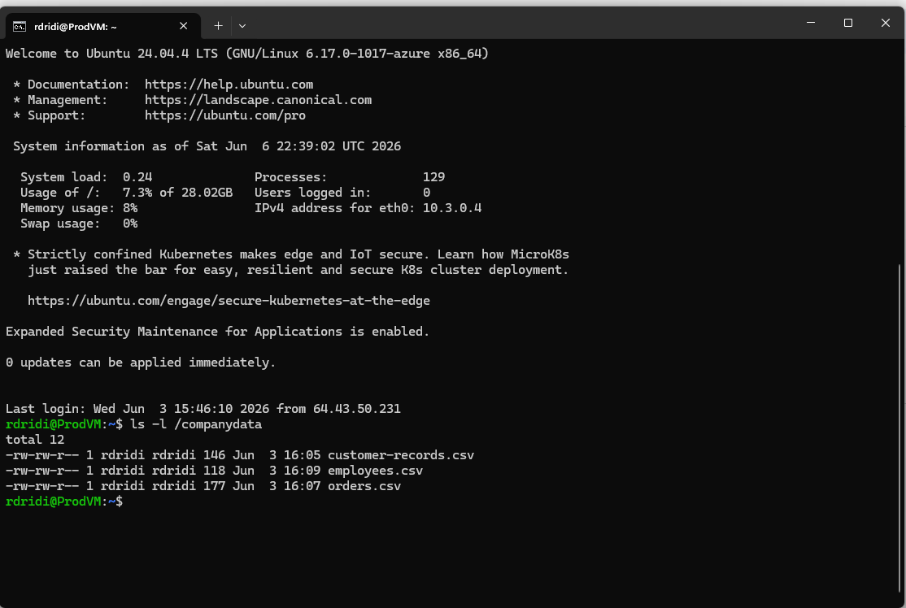
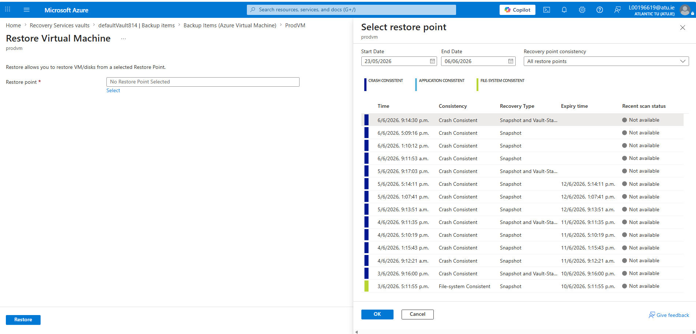
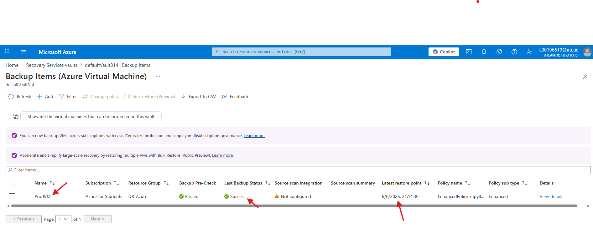
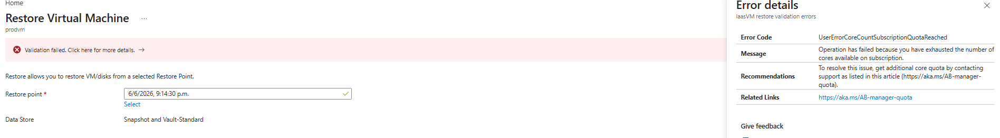
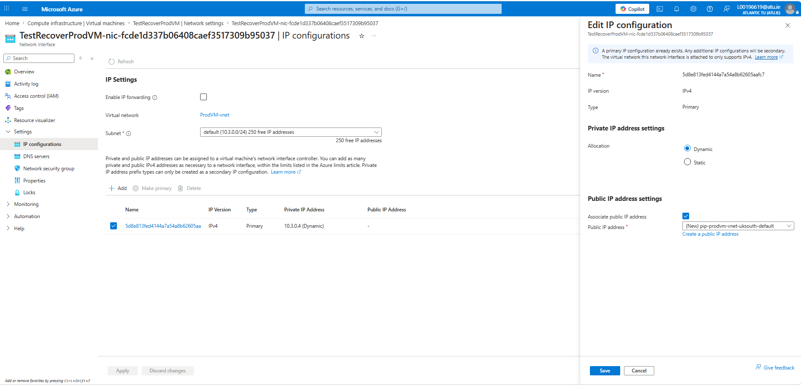
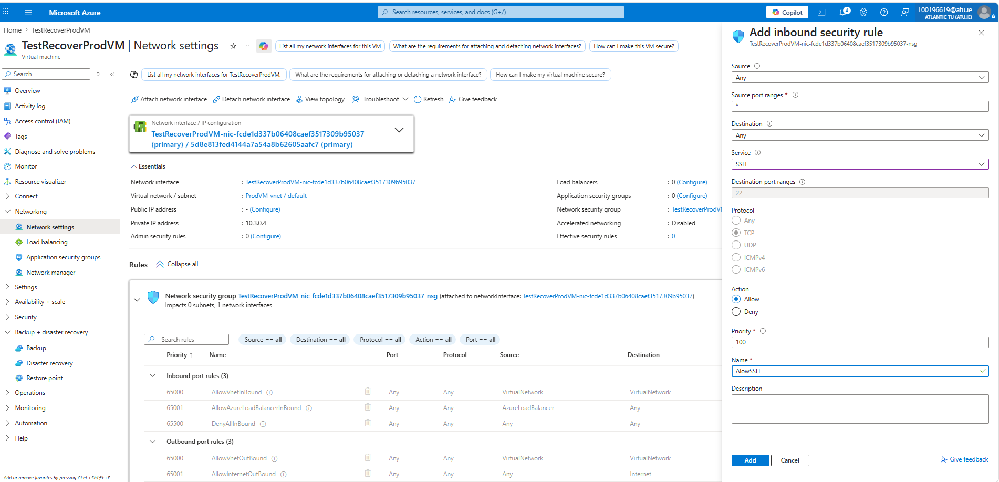
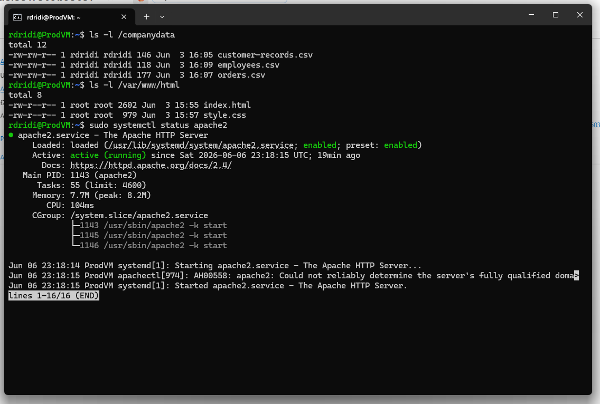

### Project Overview

This phase of the project examined Azure Backup and the recovery options available following the loss of a virtual machine.

A new Ubuntu virtual machine was deployed within Azure and configured as a small production environment. Apache was installed to host a website and several business data files were created to represent customer, order and employee information.

Azure Backup protection was enabled during deployment and recovery points began to appear within the Recovery Services Vault. The recovery process was subsequently tested to determine whether the virtual machine, hosted application and business data could be restored successfully after complete virtual machine loss.

### Objectives of the Practical Work

The aims of this practical work are:

- Deploy a production VM within Microsoft Azure
- Install and configure an Apache web server
- Create business data files to simulate a production workload
- Configure Azure Backup 
- Create and verify recovery points
- Create the storage account required during the restore process
- Test virtual machine recovery using Azure Backup
- Confirm successful recovery of the lost data and Apache web server

### Production Virtual Machine Deployment

A new Ubuntu 24.04 virtual machine named ```ProdVM``` was created. During deployment, Azure Backup was enabled to allow recovery points to be created for the virtual machine.

Once deployed, Apache was installed and configured to host the website developed during the AWS phase of the project. Access to the website was verified using the virtual machine's public IP address.

To represent a small production environment, a directory named `/companydata` was created and populated with sample business data.

The following files were added:

- customer-records.csv
- orders.csv
- employees.csv



The files contained customer, order and employee records. They were checked again after the recovery process to verify that the data had been restored.

### Azure Backup Configuration

A Recovery Services Vault was automatically created as part of the backup configuration and recovery points were generated for the virtual machine.

The screenshot below shows several recovery points created by Azure Backup during the day. Backups were generated at approximately four-hour intervals, including 09:11, 13:10, 17:09 and 21:14 on 06/06/2026.
Having multiple recovery points meant that different restore points could be selected depending on when the failure occurred.



Before testing the recovery process, a Storage Account was created as Azure Backup required a staging location during the restore operation.

As a precaution, an initial restore attempt was carried out while the production VM remained online. The aim was to confirm that a recovery could be completed before removing the original VM.

The latest recovery point available within the vault was selected for testing.The recovery was configured to create a new virtual machine from the backup.



The operation could not be completed because the Azure for Students subscription had reached its available CPU core allocation, preventing an additional virtual machine from being created alongside the existing workload as per below screenshot.



The original virtual machine was removed and the recovery test continued using a complete VM loss scenario.

From the Recovery Services Vault, the most recent recovery point was selected and the restore operation was started.

Once the recovery had finished, a replacement virtual machine appeared within Azure.

### Recovered Virtual Machine Testing

The recovered VM was created without a public IP address. A new public IP was therefore created and attached to the network interface.



Although the public IP address had been assigned, SSH access was still unavailable. The Network Security Group did not contain a rule allowing inbound SSH traffic, therefore a new rule was created to allow TCP port 22.



Once the rule had been applied, the same SSH key pair used by the original virtual machine was used to reconnect to the recovered system.

A number of checks were carried out after logging in. Apache was running and the website could be reached through the new public IP address. The contents of the ```/companydata``` directory were also present, including the customer, order and employee records created before the backup.

The screenshot below shows that the hostname, user account and Apache configuration had been retained after the recovery. File timestamps also matched those stored on the original virtual machine.



### Recovery Results

The production virtual machine was removed at 22:15 to simulate a failure.

Access to the recovered virtual machine was restored at 22:35. At this point SSH connectivity was working, Apache was running and the business data files were available.


| Detail               | Result               |
| --------------------| :--------------------: |
| Incident Start Time   | 22:15                |
| Service Restored Time | 22:35                |
| Recovery Time (RTO)   | 20 Minutes           |
| Recovery Point (RPO)  | Approximately 1 Hour |
| Recovery Status       | Successful           |

### Conclusion

 This practical work focused on testing Azure Backup and its ability to recover a virtual machine after a complete loss event.

 The selected recovery point was used to recreate the virtual machine. Apache was available after the recovery and the website loaded correctly. The customer, order and employee files stored within the /companydata directory were also present on the recovered system. 
 
 Some additional configuration was required after the restore. A new public IP address had to be assigned and an SSH rule was added to allow remote access to the virtual machine. A limitation was also encountered due to the Azure for Students subscription reaching its available CPU core allocation, which prevented an additional recovery VM from being created during the initial test. 
 
The recovery took approximately twenty minutes to complete. By the end of the process, Apache was running and the customer, order and employee records were available on the recovered virtual machine.

Recovery points were managed through the Azure Portal and the restore operation was also performed from the same interface. No separate backup server or dedicated storage infrastructure was required.

Compared to a traditional on-premises environment, the recovery process was straightforward. The backup and restore features were already available within the platform, making it possible to recover the workload without deploying additional systems.


