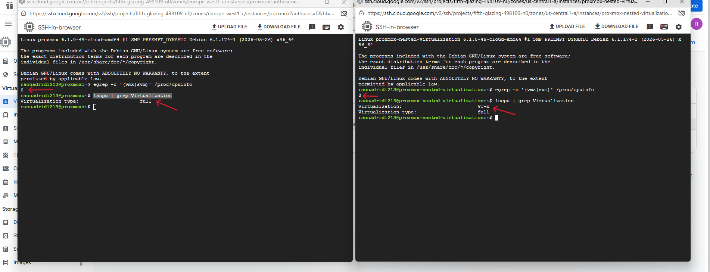
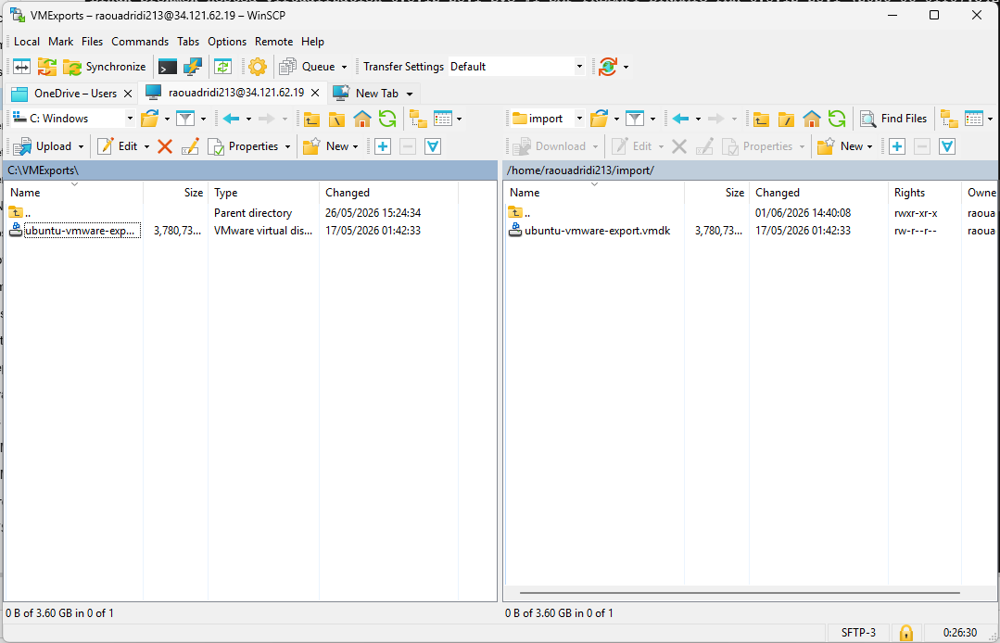
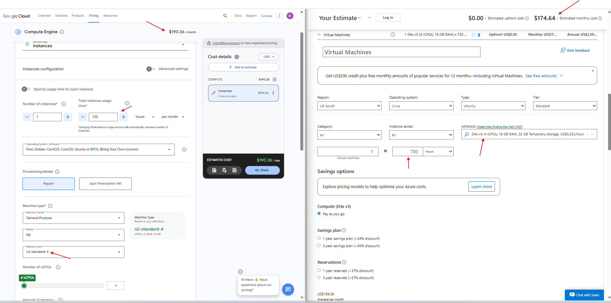

### Project overview

This week's practical work focused on deploying Proxmox VE within Google Cloud Platform using nested virtualization. The Google Cloud deployment was then compared with the Microsoft Azure environment that had been created earlier in the project.

A further objective was to determine whether a virtual machine (VM) from the Azure-hosted Proxmox server could be imported into the Google Cloud Proxmox environment testing VM migration between cloud providers and compare the deployment experience across both platforms.


### Objectives of the Practical Work

The aims of this practical work are:

- Deploy a virtual machine within Google Cloud Platform
- Enable nested virtualization 
- Install and configure Proxmox VE within Google Cloud VM
- Configure firewall access to the Proxmox web interface
- Test nested virtualization functionality
- Import a VM from the Azure-hosted Proxmox environment
- Examine vendor lock-in by testing VM portability between Proxmox environments hosted on different cloud providers
- Compare the ease of deployment between Microsft Azure and Google Cloud Platform


### Google Cloud Virtual Machine Deployment

The first phase of this practical work involved deploying a virtual machine within Google Cloud, similar to the Azure deployment, Debian 12 was selected due to its compatibility with Proxmox VE.

For testing purposes two virtual machines were created. The first VM was created through the Google Cloud GUI, whilst the deployement of the VM was successfull, it was not possible to identify a clear option for enabling nested virtualization during the creation process. Following deployment, the command ```egrep -c '(vmx|svm)' /proc/cpuinfo``` returned 0 indicating that virtualization extensions were not available within the VM. As nested virtualization could not be supported in this configuration, an alternative deployment method was required. A second VM was then deployed using Google Cloud Shell and gcloud commands which forced nested virtualization to be enabled explicitly during deployment. The below screenshot provides a comparaison betweem both VMs, the first VM deployed through the GUI returned a value of 0, whereas the second VM deployed through Cloud Shell returned 8, confirming that only the latter supported nested virtualization.



#### Command used:

```bash
gcloud compute instances create proxmox-nested-virtualization \
    --zone=us-central1-a \
    --machine-type=n2-standard-4 \
    --boot-disk-size=40GB \
    --boot-disk-type=pd-standard \
    --image-family=debian-12 \
    --image-project=debian-cloud \
    --enable-nested-virtualization
```


### Proxmox VE Installation and Configuration


Unlike the Azure deployment, Proxmox certificate generation initially failed due to the long hostname automatically assigned by Google Cloud. To fix this, the hostname was changed to a shorter one  and the below commands were used to regenerate the Proxmox certificates:

```hostnamectl set-hostname proxmox-nested-virtualization```
```pvecm updatecerts --force```

Once the certificates had been regenerated, a firewall rule was created to allow inbound access on TCP port 8006 allwoing access to the Proxmox web management interface.


### Virtual Machine Migration Testing

One of the main objectives of this practical work was to determine whether a VM created within the Azure-hosted Proxmox environment could be migrated to a Proxmox deployment hosted on Google Cloud.

To achieve this, the virtual machine's disk was first exported from the Azure Proxmox environment in VMDK format and then transferred between both Proxmox servers using WinSCP before being imported into Google Cloud Proxmox deployment using ```qm importdisk 101 /home/raouadridi213/import/ubuntu-vmware-export.vmdk local``` command.




To enable communication between the VM and the Proxmox host, the ```/etc/network/interfaces``` file was modified and the bridge configuration shown below was added.


```bash
auto vmbr0
iface vmbr0 inet static
    address 192.168.100.1/24
    bridge-ports none
    bridge-stp off
    bridge-fd 0
```


Whilst the virtual machine booted successfully after the migration, it was unable to obtain an IP address automatically. Therefore a static address was assigned by editing the Netplan configuration file using the below configuration.

```bash
network:
  version: 2
  ethernets:
    ens18:
      addresses:
        - 192.168.100.10/24
      routes:
        - to: default
          via: 192.168.100.1
      nameservers:
        addresses:
          - 8.8.8.8
```
The updated configuration was then applied using the ```netplan generate``` and ```netplan apply``` commands.

### Google Cloud vs Microsoft Azure

To provide a fair comparison between both cloud platforms, similar virtual machine specifications were selected consisting of 4 virtual CPUs, 16GB of memory and 64GB of storage.

From a deployment perspective, Azure provided a smoother overall experience. Although some initial testing and research was required to identify a suitable operating system for hosting Proxmox VE, the overall deployment and configuration process within Azure required less troubleshooting than Google Cloud.

Google Cloud initially appeared easier due to the availability of Google Cloud Shell and command-line deployment options. However, several additional issues were encountered during deployment including nested virtualization could not be enabled easily through the graphical interface and Proxmox certificate generation failed due to the long hostname automatically assigned by Google Cloud.

From a cost perspective and based on estimates obtained from the official pricing calculators, the Azure Standard D4s v3 configuration was estimated at approximately $174.64 per month, whilst the Google Cloud n2-standard-4 configuration was estimated at approximately $190.12 per month as per below screenshot. Although both platforms provided comparable resources, the Google Cloud deployment was approximately 9% more expensive based on the selected configurations and regions.




### Conclusion

This practical work showed that both Microsoft Azure and Google Cloud Platform were capable of hosting a nested Proxmox VE environment with similar hardware resources. Whilst the deployment process differed between the two platforms, both environments provided the functionality required to create and manage virtual machines.

Snapshot, backup and clone testing were not repeated during this phase of the project as these features had already been examined as part of the Azure deployment and behave in the same manner regardless of the underlying cloud provider.

The comparison between Azure and Google Cloud highlighted that both platforms are capable of hosting a nested Proxmox environment, however Azure's deployment was more straightforward and slightly cheaper. The migration test also confirmed that a VM could be moved successfully from the Azure Proxmox environment to the Google Cloud Proxmox environment. This shows that workloads do not necessarily have to remain with the same provider and can be transferred if requirements change in the future.


### References
VM creation using ```gcloud```:  https://blog.nashtechglobal.com/creating-a-virtual-machine-in-google-cloud-console-cli/


